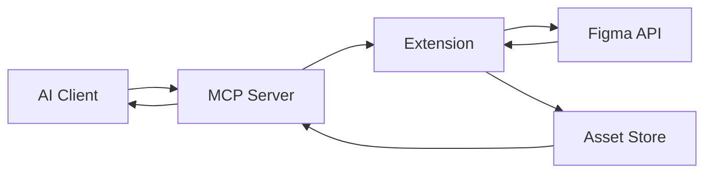

## Overview

TemPad Dev is a monorepo containing four packages that work together to provide Figma-to-code conversion through the Model Context Protocol (MCP).

## Monorepo Structure

```
tempad-dev/
├── packages/
│   ├── extension/       # Browser extension for Figma
│   ├── mcp-server/      # MCP server runtime (Hub/CLI)
│   ├── plugins/         # Public SDK for plugin authors
│   └── shared/          # Shared types and contracts
├── docs/                # Documentation site
├── AGENTS.md            # Root agent guide
├── TESTING.md           # Testing runbook
└── package.json         # Root workspace config
```

## Package Roles

### Extension (`@tempad-dev/extension`)

**Location:** `packages/extension/`

**Purpose:** Browser extension that runs on `https://www.figma.com/*` and implements MCP tool behavior.

**Key directories:**
- `mcp/` - MCP tool implementations and runtime
  - `tools/` - Tool handlers (get_code, get_structure, get_screenshot, token)
  - `runtime.ts` - Tool routing and validation
  - `assets.ts` - Asset upload integration
- `codegen/` - Code generation pipeline
- `components/` - Vue UI components
- `rewrite/` - Figma script rewrite rules
- `entrypoints/` - Extension entry points (content, background, rewrite)
- `worker/` - Web worker for code generation
- `utils/` - Utility functions

**Tech stack:**
- TypeScript
- Vue 3 + WXT (Web Extension Toolkit)
- WebSocket transport for MCP
- Tailwind-compatible class generation

### MCP Server (`@tempad-dev/mcp`)

**Location:** `packages/mcp-server/`

**Purpose:** Hub/CLI that exposes MCP tools and proxies calls to the extension.

**Key files:**
- `src/cli.ts` - MCP stdio entrypoint and Hub startup
- `src/hub.ts` - Tool routing, WebSocket server, MCP resources
- `src/tools.ts` - Tool definitions and formatters
- `src/request.ts` - Pending tool call tracking and timeouts
- `src/asset-store.ts` - Asset index and cleanup
- `src/asset-http-server.ts` - HTTP upload/download

**Tech stack:**
- TypeScript (Node.js 18+)
- `@modelcontextprotocol/sdk`
- WebSocket transport
- Pino logging

### Plugins (`@tempad-dev/plugins`)

**Location:** `packages/plugins/`

**Purpose:** Public SDK for plugin authors to customize code generation.

**Key files:**
- `src/index.ts` - Public exports (types, hooks, helpers)
- `README.md` / `README.zh-Hans.md` - User-facing documentation

**Tech stack:**
- TypeScript
- ESM + DTS output
- Build tool: tsdown

### Shared (`@tempad-dev/shared`)

**Location:** `packages/shared/`

**Purpose:** Shared contracts between extension and MCP server.

**Key files:**
- `src/mcp/constants.ts` - Payload and message limits
- `src/mcp/tools.ts` - Tool schemas and result types
- `src/mcp/protocol.ts` - WebSocket message shapes
- `src/figma/color.ts` - Color formatter utilities
- `src/index.ts` - Public exports

**Tech stack:**
- TypeScript
- Zod schemas
- Build tool: tsdown

## Data Flow



1. AI client sends MCP request to server
2. MCP server proxies request to extension via WebSocket
3. Extension queries Figma API and generates code
4. Extension uploads assets to asset store
5. Extension returns result to MCP server
6. MCP server formats and returns to AI client

## Cross-Package Communication

### Schema Changes

When changing tool schemas or contracts:

1. Update `packages/shared` first
2. Update `packages/mcp-server` second
3. Update `packages/extension` last
4. Re-check payload limits and omission rules

### Asset Pipeline

Large binaries (images, fonts) are handled through the asset pipeline:

- Extension uploads to asset store
- MCP server serves via HTTP
- Results include `asset://` URIs, not base64 data

## Package Manager

TemPad Dev uses **pnpm** with workspace features:

- Workspace scripts run with `pnpm -r <script>`
- Filter specific packages with `pnpm --filter <package> <script>`
- Root-level commands orchestrate cross-package operations

## Build Tools

- **Extension:** WXT (Web Extension Toolkit)
- **MCP Server:** tsdown
- **Plugins:** tsdown
- **Shared:** tsdown

## Testing Architecture

- **Test runner:** Vitest
- **Browser tests:** @vitest/browser-playwright + Chromium
- **Coverage provider:** Istanbul
- **Workspace config:** Root `vitest.config.ts` + `vitest.workspace.ts`

See [Testing](/development/testing) for details.
